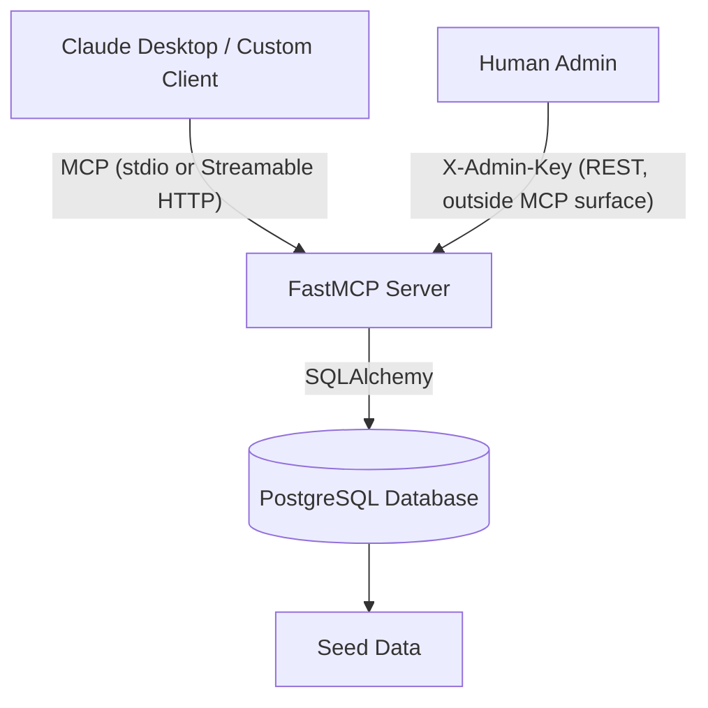

# ERP-lite MCP Server

[](https://m8ven.ai/mcp/josephkamau32-erp-lite-mcp-k0xj5k)

An enterprise-ready Model Context Protocol (MCP) server that exposes ERP functionalities to AI agents. Built as a portfolio project to demonstrate AI/ML engineering maturity, this project features a realistic data schema, a genuinely enforced human-in-the-loop approval workflow for write actions, and a full compliance-style audit trail.

## Overview

As enterprise AI adoption accelerates, providing LLMs with direct read/write access to ERPs is becoming essential. However, autonomous agents should not execute consequential operations (like creating purchase orders or altering system configurations) without human oversight.

This server demonstrates a robust "human-in-the-loop" pattern:
- The AI agent can query **open sales orders**, check **inventory levels**, and identify **low-stock items** using its read-only tools.
- When an agent decides to replenish stock, it can only propose a **purchase requisition** in a `pending_approval` state.
- **The agent cannot approve its own requisition.** When it creates the requisition, a secure `approval_token` is generated and saved to the database, but is *never* returned to the agent.
- A human administrator can view pending requisitions and their tokens via a dedicated, authenticated REST endpoint (`GET /admin/pending-requisitions`) that sits entirely outside the MCP tool surface — no agent can reach it.
- The human retrieves the token through that endpoint and supplies it back to approve the requisition, closing the loop with a real access-control check (constant-time token comparison), not just a naming convention.
- Every tool call — successful or failed — is written to an **append-only audit log**, with sensitive values like `approval_token` redacted before persistence.

## Architecture



## Demo

https://github.com/user-attachments/assets/8584d882-ecb2-43f2-bd31-7a095bedd25c

*Checking low-stock inventory → agent proposing a purchase requisition → retrieving the approval token via the admin endpoint → approving the requisition → resulting audit log entry.*

## Quick Start (Docker)

First, create your `.env` file and set a secure Admin API key:

```bash
cp .env.example .env
# Edit .env and set ADMIN_API_KEY to a secure, random value
```

Then start the containers:

```bash
docker compose up
```

This spins up:
- A PostgreSQL database, health-checked, pre-seeded with realistic enterprise data for sales orders, inventory, requisitions, and an empty audit log table.
- The MCP server, exposing the Streamable HTTP transport on port 8000.

> **⚠️ Upgrading from a previous version?** `seed_data.sql` only runs via `docker-entrypoint-initdb.d` on a **fresh, empty** Postgres volume. If you already have a `pgdata` volume from an earlier run, new tables (like `audit_log`) won't be created automatically. To pick up schema changes:
> ```bash
> docker compose down -v
> docker compose up --build
> ```

## Tools Exposed (MCP)

| Tool | Type | Description |
|---|---|---|
| `get_open_orders(status="open", limit=20)` | Read | Retrieves sales orders by status. |
| `check_inventory(material_id)` | Read | Checks inventory level and computes whether it's below the reorder point. |
| `get_low_stock_items()` | Read | Identifies all inventory items below their reorder threshold. |
| `create_requisition(material_id, quantity, requested_by)` | **Write** | Creates a purchase requisition in `pending_approval` state; silently generates and stores an `approval_token`. |
| `approve_pending_requisition(requisition_id, approved_by, approval_token)` | **Write** | Approves a pending requisition — only succeeds with the correct token, sourced from the human-only admin endpoint below. |

All tool calls, successful or failed, are recorded in the append-only audit log. Sensitive arguments (e.g. `approval_token`) are redacted before being persisted.

## Admin Endpoints (human-only, outside the MCP tool surface)

- `GET /admin/pending-requisitions` — lists pending requisitions with their approval tokens.
- `GET /admin/audit-log?limit=50` — returns the most recent audit log entries, newest first (`limit` default 50, max 500).

Both require an `X-Admin-Key` header matching the `ADMIN_API_KEY` environment variable, and fail closed (HTTP 500) if that variable isn't set at all — there is no default key baked into the app.

## Testing Locally

### Custom Python client (proves remote Streamable HTTP transport works independent of any chat client)

```bash
python client.py
```

### Claude Desktop (stdio transport)

```json
{
  "mcpServers": {
    "erp-lite": {
      "command": "/absolute/path/to/erp-lite-mcp/.venv/Scripts/python.exe",
      "args": ["-m", "src.server"],
      "env": {
        "PYTHONUNBUFFERED": "1",
        "PYTHONIOENCODING": "utf-8",
        "PYTHONPATH": "/absolute/path/to/erp-lite-mcp"
      }
    }
  }
}
```

> **Windows note:** Claude Desktop's sandboxing frequently fails to resolve `uv run` relative module paths correctly. Using the absolute path to `.venv\Scripts\python.exe`, with `PYTHONPATH` set explicitly, is the reliable configuration.

## Running Unit Tests

```bash
uv run pytest
```

Covers tool logic, the full requisition lifecycle (create → pending → wrong-token rejection → correct-token approval), and audit logging (including token redaction and failed-attempt capture).

> All tests run against an **in-memory SQLite database** (`SessionLocal` monkeypatched in fixtures) — no Postgres or Docker required. CI (GitHub Actions) uses the same approach, so no database service is configured in the workflow.

## CI

Every push and pull request to `main` runs the full `pytest` suite via GitHub Actions.

## Design Decisions Worth Knowing

- **The approval gate is an access-control mechanism, not a naming convention.** `create_requisition` never returns the token to the caller; `approve_pending_requisition` performs a constant-time comparison (`secrets.compare_digest`) against the stored value, so there's no timing side-channel and no path by which the same agent session can complete both halves of the workflow on its own.
- **The admin surface is intentionally separate from the MCP tool surface.** Tokens and audit history are retrievable only via authenticated REST routes an agent has no tool access to — the trust boundary is structural, not just a prompt-level instruction telling the agent not to self-approve.
- **Audit logging is fire-and-forget but not silent.** A logging failure never blocks a real tool response, but is written to server stderr, so an audit pipeline failure is observable in ops rather than invisible.

## Future Enhancements

- **Token security:** the `approval_token` is currently stored as plaintext so the admin endpoint can serve it directly. A production version would deliver it via a side channel (email/Slack) at creation time and store only a salted hash, never exposing plaintext through any API.
- **Authentication & RBAC:** the admin routes currently use a single shared-secret `ADMIN_API_KEY`. Production use would need real identity-based auth and role checks (e.g. verifying `approved_by` actually holds approval rights for the requisition's value/material).
- ~~**Audit logging**~~ ✅ **Implemented.** Every tool call is recorded in an append-only `audit_log` table with tool name, redacted arguments, result (including failures), and timestamp — accessible via `GET /admin/audit-log`.
- **Policy search resource:** expose procurement policy documents to the agent as an MCP Resource with semantic search, so the agent can check policy context before proposing a requisition.

## License

This project is licensed under the MIT License - see the [LICENSE](LICENSE) file for details.