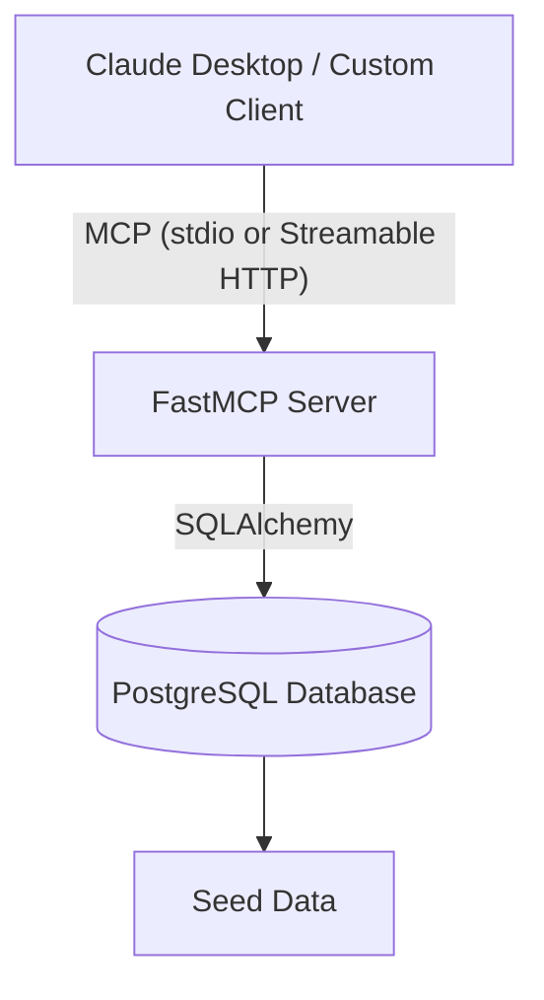

# ERP-lite MCP Server

An enterprise-ready Model Context Protocol (MCP) server that exposes ERP functionalities to AI agents. Built as a portfolio project to demonstrate AI/ML maturity, this project features a realistic data schema and a critical human-in-the-loop workflow for write actions.

## Overview

As enterprise AI adoption accelerates, providing LLMs with direct read/write access to ERPs is becoming essential. However, autonomous agents should not execute consequential operations (like creating purchase orders or altering system configurations) without human oversight.

This server demonstrates a robust "human-in-the-loop" pattern:
- The AI agent can query **open sales orders**, check **inventory levels**, and identify **low-stock items** using its read-only tools.
- When an agent decides to replenish stock, it can only propose a **purchase requisition** in a `pending_approval` state.
- **The agent cannot approve its own requisition.** When it creates the requisition, a secure `approval_token` is generated and saved to the database, but is *not* returned to the agent.
- A human administrator can view pending requisitions and their tokens via a dedicated, authenticated REST endpoint (`GET /admin/pending-requisitions`). 
- The human must intervene to approve the requisition by providing the correct token to the agent (or an approval mechanism) to satisfy the gate.

## Architecture



## Quick Start (Docker)

To get started quickly, run the entire stack with Docker Compose.
First, create your `.env` file to set a secure Admin API key:

```bash
cp .env.example .env
# Edit .env and set your ADMIN_API_KEY to a secure value
```

Then start the containers:

```bash
docker compose up
```

This spins up:
- A PostgreSQL database (pre-seeded with realistic enterprise data for sales orders, inventory, and requisitions), with health checks configured.
- The MCP server exposing the Streamable HTTP transport on port 8000.

> **⚠️ Upgrading from a previous version?** The `seed_data.sql` script only runs via `docker-entrypoint-initdb.d` on a **fresh, empty** Postgres volume. If you already have a `pgdata` volume from a prior run, new tables (like `audit_log`) won't be created automatically. To pick up schema changes, wipe the volume and rebuild:
> ```bash
> docker compose down -v
> docker compose up --build
> ```

## Tools Exposed

- `get_open_orders(status="open", limit=20)`: Retrieves a list of sales orders by status.
- `check_inventory(material_id)`: Checks the inventory level and computes if it's below the reorder point.
- `get_low_stock_items()`: Intelligent query that identifies all inventory items below their reorder threshold.
- `create_requisition(material_id, quantity, requested_by)`: **WRITE TOOL**. Creates a new purchase requisition in a `pending_approval` state and silently records an `approval_token`.
- `approve_pending_requisition(requisition_id, approved_by, approval_token)`: **WRITE TOOL**. Approves a pending requisition. Must be explicitly triggered by human confirmation using the token retrieved from the admin endpoint.

All tool calls (both successful and failed) are automatically recorded in the **append-only audit log** for SOX-style compliance. Sensitive arguments like `approval_token` are redacted before persistence.

## Admin Endpoints

- `GET /admin/pending-requisitions`: Lists all pending requisitions with their approval tokens.
- `GET /admin/audit-log?limit=50`: Returns the most recent audit log entries (newest first). Supports `?limit=N` (default 50, max 500).

Both endpoints require the `X-Admin-Key` header matching the `ADMIN_API_KEY` environment variable.

## Demo

<!-- TODO: Insert screen recording here demonstrating the agent workflow and human approval gate -->

## Testing Locally

### Using the Custom Python Client

To prove that this server supports remote transport via HTTP, you can use the built-in client script:

```bash
python client.py
```

### Using Claude Desktop (Stdio transport)

To test with Claude Desktop, configure your `claude_desktop_config.json` to use the `uv run` command:

```json
{
  "mcpServers": {
    "erp-lite": {
      "command": "C:\\Absolute\\Path\\To\\erp-lite-mcp\\.venv\\Scripts\\python.exe",
      "args": [
        "-m",
        "src.server"
      ],
      "env": {
        "PYTHONUNBUFFERED": "1",
        "PYTHONIOENCODING": "utf-8",
        "PYTHONPATH": "C:\\Absolute\\Path\\To\\erp-lite-mcp"
      }
    }
  }
}
```

> **Note for Windows Users:** Claude Desktop runs in a sandboxed environment on Windows. Using `uv run` directly inside the config often fails to resolve relative module paths correctly. It is highly recommended to provide the absolute path to the `.venv\Scripts\python.exe` and explicitly pass your project directory as the `PYTHONPATH` environment variable as shown above.

## Running Unit Tests

To run the `pytest` suite testing the tool logic, requisition lifecycle, and audit logging:

```bash
uv run pytest
```

> **Note:** All tests run against an **in-memory SQLite database** — no Postgres container or Docker is needed. The `SessionLocal` is monkeypatched in the test fixture. CI (GitHub Actions) uses the same approach, so no database service is configured in the workflow.

## Future Enhancements

- **Token Security:** Currently, the `approval_token` is stored as plaintext in the database so the admin endpoint can serve it. In a fully-fledged system with email or Slack integration, the token should be sent directly to the approver's inbox and stored as a cryptographic hash in the database, preventing it from ever being exposed via an API route.
- **Authentication & RBAC:** Implement Role-Based Access Control to ensure the `approved_by` identity has the actual rights to approve the specific value/material in the requisition. The admin route currently uses a simple shared-secret `ADMIN_API_KEY`, which is sufficient for a demo but needs proper IAM in production.
- ~~**Audit Logging:**~~ ✅ **Implemented.** Every tool call is recorded in an append-only `audit_log` table with tool name, redacted arguments, result (including failures), and timestamp. Accessible via `GET /admin/audit-log`.
- **Policy Search Resource:** A RAG-like capability to expose procurement policy documents to the agent as MCP resources.
